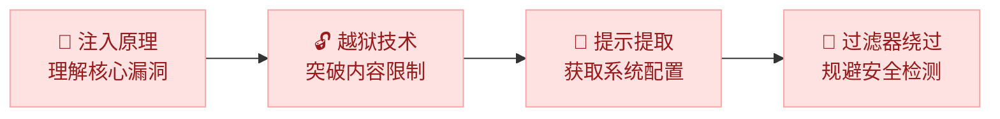

import { Cards, Card } from 'fumadocs-ui/components/card';
import { Callout } from 'fumadocs-ui/components/callout';
import { Accordion, Accordions } from 'fumadocs-ui/components/accordion';
import { ShieldAlert, Flame, KeyRound, Filter } from 'lucide-react';

<Callout title="" type="info">
预计阅读约 3-4 小时，实验约 3 小时
</Callout>

模块一为你搭建了 AI 安全的认知地基，你已经知道了 AI 系统面临哪些威胁、大语言模型为什么会"出错"、安全研究者如何系统化地分析风险。从本模块开始，我们将从"认识风险"走向"实施攻击"，聚焦 OWASP Top 10 for LLM Applications 中排名第一的威胁类别：**提示词注入（Prompt Injection）** 及其衍生攻击技术。你将亲手体验：仅凭精心设计的自然语言，不需要任何代码漏洞，就能操纵 AI 系统执行非预期操作、突破安全限制、泄露内部配置。

本模块按照攻击深度递进编排：先理解提示词注入的核心原理（为什么 AI 无法区分指令和数据），再学习越狱技术（如何突破模型的内容限制），接着掌握系统提示提取（如何获取 AI 的"设计图纸"），最后深入过滤器绕过（如何规避安全检测）。学习攻击不是目的，而是为了在模块三中更好地构建防御。只有深刻理解攻击者的手段，才能设计出真正有效的防护体系。

## 学习目标

<Callout title="完成本模块后，你将能够：" type="success">
- 理解提示词注入的本质，掌握直接注入、间接注入和多轮对话注入的原理与区别
- 掌握主流越狱技术，包括 DAN 系列角色扮演、编码绕过、逻辑操纵和场景构造
- 学会系统提示提取技术（直接请求、间接诱导、编码翻译），了解如何获取 AI 系统的内部配置
- 理解内容过滤器的三种类型及其工作机制，掌握字符级、语义级、结构级绕过技术
</Callout>

## 章节概览

<Cards>
  <Card icon={<ShieldAlert />} title="第1章：提示词注入基础原理" href="/docs/02-prompt-attacks/injection-basics">
    为什么 AI 无法区分指令和数据？掌握直接注入、间接注入、多轮对话注入三种攻击方式，分析真实攻击案例
  </Card>
  <Card icon={<Flame />} title="第2章：越狱技术详解" href="/docs/02-prompt-attacks/jailbreaking">
    学习 DAN 系列角色扮演、Base64 编码绕过、逻辑操纵和场景构造，追踪越狱技术的攻防演化历程
  </Card>
  <Card icon={<KeyRound />} title="第3章：系统提示提取技术" href="/docs/02-prompt-attacks/prompt-extraction">
    掌握直接请求、间接诱导、编码翻译等提取方法，分析必应 Sydney 系统提示泄露等真实案例
  </Card>
  <Card icon={<Filter />} title="第4章：内容过滤器绕过技术" href="/docs/02-prompt-attacks/filter-bypass">
    深入理解关键词、语义、混合过滤器的工作机制，学习字符级、语义级、结构级三大类绕过技术
  </Card>
</Cards>

## 配套实验

<Cards>
  <Card title="实验 2.1：提示词注入" href="/docs/02-prompt-attacks/labs/prompt-injection">
    通过实际操作体验直接注入、间接注入等攻击技术
  </Card>
  <Card title="实验 2.2：越狱技术体验" href="/docs/02-prompt-attacks/labs/jailbreaking">
    亲手尝试不同的越狱技术，观察模型的响应差异
  </Card>
  <Card title="实验 2.3：系统提示提取" href="/docs/02-prompt-attacks/labs/prompt-extraction">
    使用多种技术尝试提取系统提示词，体验攻防对抗
  </Card>
</Cards>

<Callout title="安全提示" type="warn">
本模块介绍的攻击技术仅供学习和研究目的。所有实验在 Cloud Studio 云平台的受控环境中进行（Transformers + Qwen2-1.5B-Instruct），不影响任何生产系统。学习攻击是为了更好地防御。
</Callout>

## 常见问题

<Accordions>
  <Accordion title="提示词攻击和传统的 SQL 注入有什么区别？">
    两者的核心原理相似，都是利用系统无法区分指令和数据的问题。但 SQL 注入针对的是数据库查询，而提示词攻击针对的是 AI 模型。SQL 注入可以通过参数化查询完全防御，但提示词攻击的防御更加困难，因为 AI 模型本质上需要理解自然语言输入。第 1 章会详细对比两者的区别。
  </Accordion>
  <Accordion title="学习这些攻击技术会不会被用于非法用途？">
    学习攻击技术的目的是为了更好地防御。就像学习密码破解技术是为了设计更安全的密码策略一样。理解攻击者的方法是建立有效防御的前提。请始终在授权的环境中进行实验，并遵守负责任的漏洞披露原则。
  </Accordion>
  <Accordion title="这些攻击技术对所有 AI 模型都有效吗？">
    不同模型的安全性差异很大。大型商业模型（如 GPT-4、Claude）有较强的安全对齐，但仍然可能被绕过。开源模型或未经安全微调的模型更容易受到攻击。第 2 章会讨论越狱技术在不同模型上的效果差异。
  </Accordion>
</Accordions>
