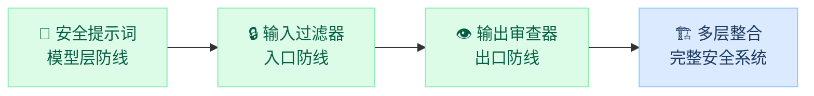

import { Cards, Card } from 'fumadocs-ui/components/card';
import { Callout } from 'fumadocs-ui/components/callout';
import { Accordion, Accordions } from 'fumadocs-ui/components/accordion';
import { ShieldCheck, Filter, Eye, Layers } from 'lucide-react';

<Callout title="" type="info">
预计阅读约 3-4 小时，实验约 3 小时
</Callout>

在模块二中，我们从攻击者的视角深入学习了提示词注入、越狱、系统提示提取和过滤器绕过四大类攻击技术。这些知识揭示了一个核心事实：**AI 系统的安全不能仅靠模型本身的安全对齐来保障，还需要在应用层面构建系统化的防御体系。**

本模块将完成从"攻"到"防"的关键转变。我们不再只是发现漏洞，而是要**动手构建防御组件**，并最终将它们组装成一个完整的安全 AI 应用。

<Callout title="模块设计理念：零件 → 整机" type="success">
每学一章，就动手做一个实验。四个实验环环相扣，最终组装出一个可运行的安全 AI 聊天助手：

- 第 1 章 + 实验 3.1：构建"安全系统提示词"组件
- 第 2 章 + 实验 3.2：构建"输入过滤器"组件（关键词过滤 + 语义分类 + 格式约束）
- 第 3 章 + 实验 3.3：构建"输出审查器"组件（敏感信息检测 + 内容安全 + 一致性验证）
- 第 4 章 + 实验 3.4：将三个组件串联为完整的安全 AI 聊天助手，并进行红蓝对抗测试
</Callout>

## 学习目标

<Callout title="完成本模块后，你将能够：" type="success">
- 识别常见的系统提示词安全缺陷，掌握分层结构、优先级声明等安全设计原则
- 编写输入过滤和规范化函数，使用关键词过滤、语义分类、格式约束三种方法拦截恶意请求
- 构建输出审查器，实现敏感信息检测、内容安全分类和一致性验证
- 将多层防御组件整合为完整的纵深防御体系，理解各层之间的协作流程
- 对自己构建的系统进行红蓝对抗测试，评估防御有效性
</Callout>

## 章节概览

<Cards>
  <Card icon={<ShieldCheck />} title="第1章：安全系统提示词设计" href="/docs/03-ai-defense/secure-prompt-design">
    识别常见提示词安全缺陷，掌握分层结构、优先级声明、边界强化等核心设计原则，学会编写防注入防提取的系统提示词
  </Card>
  <Card icon={<Filter />} title="第2章：输入层防护" href="/docs/03-ai-defense/input-protection">
    用 Python 实现三种输入检测方法（关键词过滤、语义分类、格式约束），理解各自的适用场景和组合策略
  </Card>
  <Card icon={<Eye />} title="第3章：输出层防护" href="/docs/03-ai-defense/output-protection">
    构建输出审查器，实现敏感信息检测与脱敏、内容安全分类和一致性验证，了解拦截、替换、改写三种处理方式
  </Card>
  <Card icon={<Layers />} title="第4章：多层防御整合" href="/docs/03-ai-defense/defense-integration">
    理解纵深防御思想，将输入层、模型层、输出层串联为完整处理流程，学会根据应用场景调整防御策略
  </Card>
</Cards>

## 配套实验

<Cards>
  <Card title="实验 3.1：提示词安全加固" href="/docs/03-ai-defense/labs/secure-prompt">
    重写有漏洞的系统提示词，用模块二的攻击技术验证加固效果
  </Card>
  <Card title="实验 3.2：构建输入过滤器" href="/docs/03-ai-defense/labs/input-filter">
    编写输入规范化和注入检测函数，测试对各类攻击的拦截效果
  </Card>
  <Card title="实验 3.3：构建输出审查器" href="/docs/03-ai-defense/labs/output-reviewer">
    编写敏感信息检测和脱敏函数，审查模型输出中的安全问题
  </Card>
  <Card title="实验 3.4：搭建安全 AI 聊天助手" href="/docs/03-ai-defense/labs/secure-chatbot">
    整合三个防御组件，搭建完整的安全 AI 应用并进行红蓝对抗测试
  </Card>
</Cards>

<Callout title="与模块二的关系" type="info">
本模块是模块二的"镜像"——模块二教你攻击，模块三教你防御。你在模块二学到的每一种攻击技术，都会在本模块找到对应的防御方法。建议在做实验时，随时翻阅模块二的攻击内容，用攻击技术来检验自己的防御是否有效。
</Callout>

## 常见问题

<Accordions>
  <Accordion title="这个模块需要什么编程基础？">
    与模块一/二一致，只需要 Python 基础语法。本模块的代码主要涉及字符串处理、正则表达式和函数编写，不涉及机器学习框架（如 PyTorch）。
  </Accordion>
  <Accordion title="实验 3.4 和前三个实验的关系是什么？">
    实验 3.1-3.3 分别构建一个独立的防御组件（安全提示词、输入过滤器、输出审查器）。实验 3.4 是"组装"环节，把三个组件串联成完整的安全 AI 聊天助手，然后进行红蓝对抗测试。所以请务必按顺序完成。
  </Accordion>
  <Accordion title="防御能做到 100% 安全吗？">
    不能。正如模块二所展示的，攻防是一场持续的博弈。本模块的目标是让你掌握构建防御体系的方法论和实操技能，理解"没有完美防御，但可以不断提高攻击成本"的核心理念。第 4 章会专门讨论防御体系的持续改进。
  </Accordion>
  <Accordion title="学完这个模块能做什么？">
    你将具备为 AI 应用构建基础安全防护的能力——设计安全提示词、编写输入过滤和输出审查代码、搭建多层防御架构。这些是 AI 应用开发中非常实用的技能，也是模块五安全评估的基础。
  </Accordion>
</Accordions>
