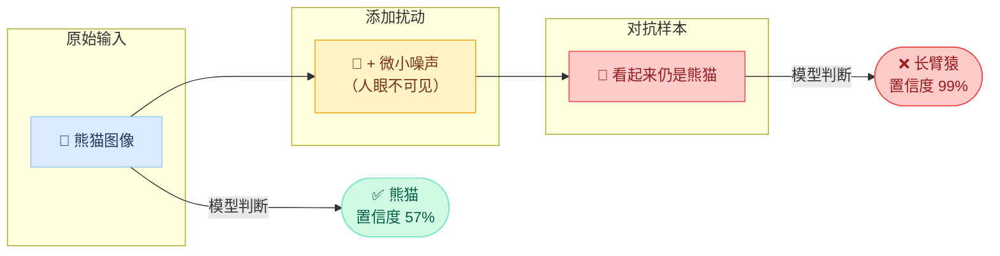
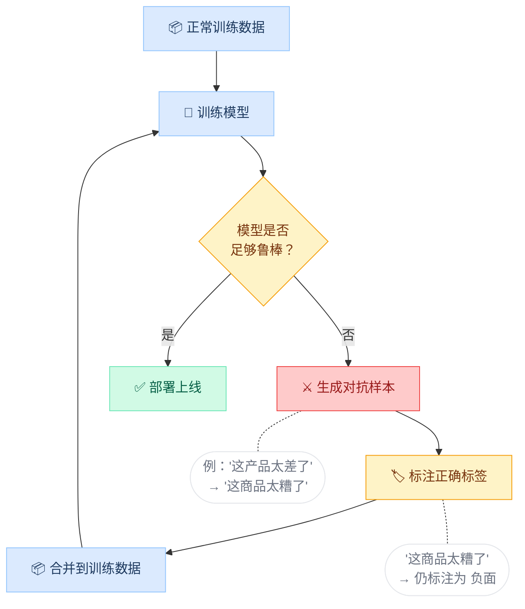
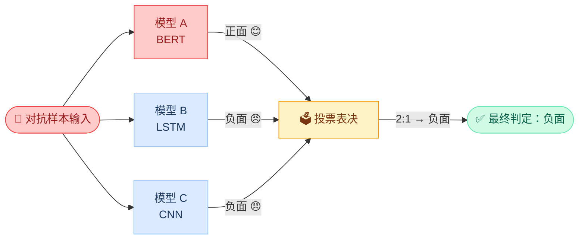

import { Callout } from 'fumadocs-ui/components/callout';
import { Tabs, Tab } from 'fumadocs-ui/components/tabs';
import { Accordion, Accordions } from 'fumadocs-ui/components/accordion';
import { Quiz } from '@/components/ui/quiz';

<Callout title="" type="info">
预计阅读约12分钟
</Callout>

## 本章导读

在模块二和三中，我们学到的所有攻击（提示词注入、越狱、系统提示提取）都有一个共同特点：通过**改变指令**来影响模型行为。但本章要介绍的对抗样本（Adversarial Examples）攻击采用一种完全不同的思路：**不改变指令，只对输入数据做微小的、人眼几乎无法察觉的修改，就能让 AI 模型产生完全错误的判断。** 一个"停车"标志加几个贴纸就被识别为"限速"标志，一封垃圾邮件换两个同形字符就逃过了检测，这就是对抗样本的威力。

本章将以概念理解为主，不涉及底层梯度计算等数学推导。我们将从直观的文本和图像示例出发，讲解对抗样本为什么有效（AI 模型与人类"看世界"的方式有何根本差异），然后介绍字符替换、同义词替换、句法变换等文本对抗的常见攻击方法，以及白盒攻击与黑盒攻击的区别。这些知识将拓展你对 AI 安全的理解。安全风险不仅存在于"对话"场景，也潜伏在一切 AI 做出判断的地方。

## 学习目标

<Callout title="本章学完后，你将能够：" type="info">
1. **解释对抗样本的基本概念**：知道什么是对抗样本，为什么 AI 模型容易受到影响
2. **区分对抗样本的主要类型**：图像对抗与文本对抗的区别
3. **理解文本对抗攻击的常见方法**：字符替换、同义词替换、句法变换
4. **认识对抗样本的现实影响**：了解实际案例和潜在威胁
</Callout>

## 1 什么是对抗样本

### 1.1 一个直观的例子

假设有一个 AI 模型负责检测垃圾邮件。以下两封邮件内容几乎相同：

```text title="原始邮件（被正确识别为垃圾邮件）"
恭喜您获得免费 iPhone！立即点击领取：http://spam.example.com
```

```text title="修改后的邮件（逃过检测）"
恭喜您获得免費 iPhоne！立即点击领取：http://spam.example.com
```

你能看出区别吗？修改后的版本做了两个微小改动：

1. "免费" → "免費"（简体换繁体）
2. "iPhone" 中的 "o" → "о"（拉丁字母 o 换成西里尔字母 о）

这两个改动对人类来说几乎不可见，但对于逐字符处理的 AI 模型来说，可能完全改变了输入特征，导致检测失败。

**这就是对抗样本的核心思想：对输入做人类难以察觉的修改，使 AI 模型产生错误判断。**

### 1.2 为什么 AI 模型容易受影响

对抗样本之所以有效，根源在于 AI 模型和人类"看世界"的方式不同：

| 对比维度 | 人类 | AI 模型 |
|----------|------|---------|
| 识别方式 | 关注整体含义和上下文 | 关注具体的特征值和统计模式 |
| 容错能力 | 对微小变化不敏感（"免费" ≈ "免費"） | 对输入特征高度敏感 |
| 对抗鲁棒性 | 天然具备（人脑演化优势） | 需要专门训练才能获得 |

简单来说：人类理解"含义"，AI 模型匹配"模式"。当攻击者修改了模式但保留了含义，人类不受影响，但模型可能被欺骗。

### 1.3 对抗样本的正式定义

> 对抗样本是指：对原始输入施加微小的、人类难以察觉的扰动，使目标模型产生错误输出的特制输入。

三个关键要素：
1. **微小扰动**：修改要足够小，人类不容易发现
2. **有意为之**：不是随机噪声，而是精心设计的修改
3. **导致误判**：模型的输出从正确变为错误

## 2 图像对抗 vs 文本对抗

对抗样本最早在计算机视觉领域被发现，后来扩展到了自然语言处理领域。

### 2.1 图像对抗样本（了解即可）

2013 年，Goodfellow 等人在论文中展示了一个经典实验：对一张熊猫图片添加人眼完全不可见的微小噪声后，深度神经网络以 99% 的置信度将其错误分类为"长臂猿"。


上图来自 Goodfellow 等人的原始论文，展示了 FGSM（Fast Gradient Sign Method）攻击的核心过程：原始熊猫图像 $x$（置信度 57.7%）加上一个极小系数 $\epsilon = 0.007$ 乘以损失函数梯度方向的符号 $\text{sign}(\nabla_x J(\theta, x, y))$，得到的对抗样本在人类看来毫无变化，但模型却以 99.3% 的置信度将其误判为"长臂猿"（gibbon）。

下面的流程图进一步拆解了这一攻击的三个阶段：



如图所示，整个攻击过程可分为三个阶段：

1. **原始输入阶段**：一张正常的熊猫图片被送入分类模型，模型以 57% 的置信度正确输出"熊猫"，这是完全正常的结果。
2. **添加扰动阶段**：攻击者通过算法（如 FGSM）计算出一组精心设计的噪声，叠加到原始图像的每个像素上。这些扰动的幅度极小，人眼完全无法分辨修改前后的差异。
3. **对抗样本阶段**：修改后的图像在人类看来与原图毫无区别，但模型却以高达 99% 的置信度将其误判为"长臂猿"，不仅判断错误，而且比正确分类时还要"自信"。

这个案例震动了整个 AI 安全领域，它揭示了两个关键事实：
- **高置信度 ≠ 高可靠性**：模型输出的置信度并不能作为结果正确性的保证
- **微小扰动 → 巨大偏差**：AI 模型的决策边界可能极为脆弱，在人类感知不到的尺度上就会被跨越

<Callout title="本课程不深入图像对抗" type="warn">
图像对抗样本的生成涉及梯度计算（如 FGSM、PGD 等算法），超出了本课程的入门定位。我们重点关注与 LLM 更相关的**文本对抗样本**。
</Callout>

### 2.2 文本对抗样本

文本领域的对抗攻击原理相同，即对文本做微小修改来欺骗模型，但实现方式不同，因为文本是离散的（一个字要么改了要么没改），而图像是连续的（像素值可以微调）。

2020 年，Jin 等人提出的 **TextFooler** 是文本对抗攻击领域的代表性工作。下图展示了 TextFooler 如何通过替换少量关键词来欺骗 SOTA NLP 模型（如 BERT、LSTM、CNN）：


如图所示，原始影评 *"The characters, cast in impossibly **contrived situations**, are **totally** estranged from reality."* 被模型正确分类为**负面评价**。TextFooler 仅将 "contrived situations" 替换为 "engineered circumstances"、"totally" 替换为 "fully"，这些替换完全不影响句子含义，人类读后感受完全相同，但模型却将其误判为**正面评价**。

这正是词级扰动（同义词替换）的典型案例，也是下面方法二所介绍的攻击方式。

文本对抗的常见方法包括：

**方法一：字符级扰动**

| 技术 | 示例 | 原理 |
|------|------|------|
| 形近字替换 | "免费" → "免費" | 利用形状相似的字符 |
| 同形异码字符 | "apple" → "аpple"（首字母换成西里尔字母 а） | Unicode 中存在外观相同但编码不同的字符 |
| 插入零宽字符 | "恶意" → "恶\u200b意" | 插入不可见字符 |
| 字符交换 | "dangerous" → "dangeruos" | 人类能自动纠错，模型可能不行 |

**方法二：词级扰动**

| 技术 | 示例 | 原理 |
|------|------|------|
| 同义词替换 | "这部电影太好看了" → "这部电影太精彩了" | 含义不变但特征改变 |
| 反义插入 | "产品质量不好" → "产品质量不是不好" | 双重否定让模型困惑 |

**方法三：句法级扰动**

| 技术 | 示例 | 原理 |
|------|------|------|
| 语序调整 | "我很喜欢这个产品" → "这个产品，我很喜欢" | 含义不变但句法结构改变 |
| 添加无关从句 | "产品很好" → "虽然下雨了，但产品很好" | 添加与判断无关的干扰信息 |

## 3 文本对抗的真实威胁

### 3.1 攻击场景举例

了解了文本对抗的技术方法后，我们来看看它在真实世界中会带来哪些威胁。以下三个场景覆盖了内容安全、商业分析和网络安全领域，帮助你理解对抗样本并非"理论问题"，而是已经在发生的现实风险。

**场景一：绕过内容审核**

几乎所有社交平台（微博、抖音、微信等）都部署了 AI 内容审核系统，自动检测并拦截违规内容（如赌博广告、违禁品信息等）。这些系统通常依赖文本分类模型：输入一段文字，输出"违规"或"正常"。

攻击者可以利用字符级扰动技术，对违规内容做微小修改来逃过检测：

```text title="内容审核绕过示例"
原始违规内容：赌博网站       → AI 判断：违规 ✗（被拦截）

字符级扰动后：
  方式1：赌 博 网 站        → AI 判断：正常 ✓（插入全角空格）
  方式2：dǔ bó 网站        → AI 判断：正常 ✓（拼音替换）
  方式3：赌博网占           → AI 判断：正常 ✓（形近字替换）
  方式4：赌​博​网​站        → AI 判断：正常 ✓（插入零宽字符，肉眼看不出区别）
```

<Callout title="为什么这类攻击很常见？" type="info">
你可能在社交媒体上见过类似的现象，用户用谐音字、拼音、emoji 来讨论敏感话题。这本质上就是对抗样本思想的"民间应用"：通过修改文本的表面形式来绕过 AI 检测，同时人类仍然能理解原意。
</Callout>

**场景二：欺骗情感分析**

电商平台（淘宝、京东等）使用 AI 情感分析模型来自动分析商品评价。这些分析直接影响商品的排名、推荐、以及商家的信用评分。

攻击者（例如刷好评的商家或恶意差评的竞争对手）可以通过文本对抗技术操纵分析结果：

```text title="情感分析欺骗示例"
原始负面评价："这个产品质量太差了，完全不值这个价格"
→ AI 情感分析：负面 😠（置信度 92%）

词级扰动后："这个商品品质太糟糕了，完全不值这个价位"
→ AI 情感分析：正面 😊（置信度 68%）
```

这里只替换了三个同义词（"产品"→"商品"、"质量"→"品质"、"价格"→"价位"），人类读起来含义完全不变，但模型的判断可能完全翻转，这与上面介绍的 TextFooler 攻击原理一致。

这种攻击的商业危害是巨大的：

| 攻击方 | 攻击目标 | 后果 |
|--------|---------|------|
| 刷好评商家 | 让差评被误判为好评 | 虚假的高评分误导消费者 |
| 恶意竞争对手 | 让好评被误判为差评 | 正常商品被降权、信用受损 |
| 水军团队 | 批量生成对抗评论 | 大规模污染评价系统的可信度 |

**场景三：绕过恶意软件检测**

网络安全系统越来越多地使用 AI 模型来检测恶意代码、钓鱼邮件和恶意文档。攻击者可以对恶意代码做"等价变换"，即功能完全不变，但表面形式变了，从而逃过 AI 检测。

```python title="恶意代码的对抗变换示例"
# 原始恶意代码（被 AI 检测到）
import os
os.system("rm -rf /important_data")  # 删除重要数据

# ---- 对抗变换后（可能逃过检测）----

# 方式1：变量名混淆
import os as _o
_cmd = chr(114)+chr(109)+' -rf /important_data'  # 用 ASCII 码拼接命令
_o.system(_cmd)

# 方式2：添加无关注释和代码
import os
# This function performs routine system maintenance
# and cleanup of temporary files for optimization
x = 1 + 1  # normal calculation
os.system("rm -rf /important_data")
y = x * 2  # another normal operation
```

上面的两种变换都不改变代码的实际功能（仍然是删除数据），但通过变量名混淆、字符编码、添加无关代码等方式，改变了 AI 模型"看到"的特征模式，可能导致检测失败。

<Callout title="三个场景的共同规律" type="info">
不管是内容审核、情感分析还是恶意代码检测，攻击的核心逻辑都是一样的：**保留语义含义，修改表面特征**。这正是对抗样本的本质：利用了 AI 模型依赖"模式匹配"而非"语义理解"的弱点。
</Callout>

### 3.2 与提示词注入的区别

学到这里，你可能会想：这和模块二的提示词注入有什么区别？

| 对比维度 | 提示词注入 | 对抗样本 |
|----------|-----------|---------|
| 攻击目标 | 改变模型的行为指令 | 改变模型的判断结果 |
| 攻击方式 | 插入新的指令 | 修改已有的数据 |
| 攻击对象 | 生成式 AI（聊天机器人等） | 判别式 AI（分类器等） |
| 修改幅度 | 通常添加较多文本 | 尽量做最小修改 |
| 人类感知 | 攻击内容通常可被人类识别 | 修改通常难以被人类察觉 |

简单来说：提示词注入是"说服"模型做别的事，对抗样本是"欺骗"模型看错了东西。

## 4 对抗样本的防御思路

面对对抗样本这种"看不见的攻击"，我们该如何防御？目前业界主要有三种思路，可以类比为医疗防护体系：**消毒（输入预处理）、打疫苗（对抗训练）、会诊（集成防御）**。


三种思路并不互斥，在实际系统中往往会组合使用，形成多层防御。下面逐一介绍每种思路的原理、做法和局限性。

### 4.1 输入预处理

**核心思想**：在将输入送入 AI 模型之前，先对输入进行清洗和标准化，消除攻击者可能添加的扰动。简单来说，就是在模型"看到"数据之前，先把数据中可能被动过手脚的部分还原回去。

**具体做法**：

| 预处理操作 | 针对的攻击方式 | 示例 |
|-----------|---------------|------|
| 零宽字符移除 | 插入不可见字符 | "恶​意" → "恶意"（去除零宽空格） |
| Unicode 标准化 | 同形异码字符 | "аpple"（西里尔 а）→ "apple"（统一为拉丁字母） |
| 繁简统一 | 形近字替换 | "免費" → "免费"（统一为简体） |
| 拼写纠错 | 字符交换/错别字 | "dangeruos" → "dangerous" |
| 全角半角统一 | 全角空格等 | "赌　博" → "赌博" |

<Callout title="与模块三的联系" type="info">
还记得模块三第2章（输入层防护）中学到的"特殊字符清洗"吗？那其实就是输入预处理防御思路的具体应用。当时我们学的是防御提示词注入，但同样的技术也能用来防御对抗样本，安全防御的很多方法是相通的。
</Callout>

**局限性**：
- 只能防御**字符级扰动**，对同义词替换、句法变换等保留了正常文字形式的攻击无效
- 过度清洗可能影响正常输入（例如，用户合理使用的繁体字也会被转换）
- 攻击者不断发现新的扰动方式，预处理规则需要持续更新

### 4.2 对抗训练

**核心思想**：在模型训练阶段，故意生成对抗样本并加入训练数据，让模型提前"见过"各种攻击手法，从而学会识别和抵抗扰动。这类似于消防演练，平时模拟各种突发情况，真正遇到时才能从容应对。

**工作流程**：



如图所示，对抗训练是一个**迭代循环**的过程：训练模型 → 用模型自身的弱点生成对抗样本 → 将对抗样本（标注正确标签）加入训练数据 → 重新训练。每一轮迭代，模型都会修补上一轮暴露的弱点，逐渐变得更加鲁棒。

**为什么有效？** 

通过对抗训练，模型不再只记住"这产品太差了 = 负面"这种固定模式，而是学会了更深层的判断依据。就像一个人见过各种方言、口音后，更能抓住语言的核心含义，不会因为口音不同就"听不懂"。

**局限性**：
- **训练成本高**：需要生成大量对抗样本，训练时间和计算资源显著增加
- **无法穷尽**：攻击方式无穷无尽，不可能在训练中覆盖所有可能的扰动
- **模型精度可能下降**：过多的对抗样本可能影响模型在正常数据上的表现（正常情况下也会"过度警惕"）

### 4.3 集成防御

**核心思想**：不依赖单个模型的判断，而是使用多个结构不同的模型同时分析同一输入，通过"投票表决"得出最终结果。单个模型可能被对抗样本欺骗，但要同时骗过多个不同的模型就困难得多。

**工作方式**：



如图所示，面对同一个对抗样本"这个商品品质太糟糕了"，模型 A（BERT）被欺骗后输出了错误的"正面"判断（红色），但模型 B（LSTM）和模型 C（CNN）仍然正确判断为"负面"（蓝色）。通过投票表决，最终以 2 比 1 得出正确结果。

**为什么有效？**

不同的模型使用不同的算法和特征提取方式，它们的"弱点"各不相同。一个对抗样本可能恰好利用了模型 A 的弱点，但这个弱点在模型 B 和模型 C 中并不存在。攻击者要同时欺骗所有模型，难度会成倍增加。

**局限性**：
- **资源消耗大**：需要训练和部署多个模型，成本是单模型的数倍
- **响应速度慢**：多个模型同时推理，延迟增加，不适合对实时性要求很高的场景
- **并非绝对安全**：如果多个模型共享相似的结构或训练数据，它们可能有相同的弱点，导致集成防御失效

### 4.4 三种防御思路的对比

| 对比维度 | 输入预处理 | 对抗训练 | 集成防御 |
|----------|-----------|---------|---------|
| 作用阶段 | 模型推理前 | 模型训练时 | 模型推理时 |
| 是否修改模型 | 否，独立于模型 | 是，重新训练模型 | 否，但需部署多个模型 |
| 主要优点 | 实现简单，部署成本低 | 从根本上提升模型鲁棒性 | 大幅提高攻击难度 |
| 主要缺点 | 只能防字符级攻击 | 训练成本高，无法穷尽 | 资源消耗大，响应变慢 |
| 适用场景 | 所有系统的基础防线 | 安全要求高的核心模型 | 关键决策场景 |

<Callout title="防御的核心原则" type="warn">
没有任何单一防御手段是万无一失的，这与模块三学到的"纵深防御"原则完全一致。在实际系统中，最佳实践是将三种思路组合使用：**输入预处理作为第一道防线**过滤明显的字符级攻击，**对抗训练增强模型本身的抗扰动能力**，**集成防御在关键环节提供额外的安全保障**。
</Callout>

## 本章小结

本章介绍了对抗样本这一重要的 AI 安全风险。

**核心概念**：对抗样本是对输入做微小的、人类难以察觉的修改，使 AI 模型产生错误判断。根源在于 AI 模型关注"模式"而非"含义"。

**文本对抗方法**：字符级扰动（形近字、同形异码、零宽字符）、词级扰动（同义词替换）、句法级扰动（语序调整、添加干扰信息）。

**与提示词注入的区别**：提示词注入改变指令，对抗样本修改数据；前者"说服"模型，后者"欺骗"模型。

在实验 4.1 中，你将亲手体验文本对抗攻击，通过各种文字修改技术来影响 Qwen 模型的判断。

## 课后思考

<Accordions>
  <Accordion title="思考题1：生活中的对抗样本">
    验证码（CAPTCHA）的设计理念与对抗样本有什么关系？提示：验证码故意对文字做扭曲、加噪声，是为了让 AI 难以识别但人类能识别。
  </Accordion>
  <Accordion title="思考题2：防御的困境">
    如果一个社交平台同时使用关键词过滤和 AI 语义分析来检测违规内容，攻击者可能如何结合本章学到的文本对抗技术和模块二学到的绕过技术来规避检测？
  </Accordion>
</Accordions>

## 自测 Quiz

<Quiz questions={[
  {
    question: '对抗样本与提示词注入的核心区别是什么？',
    options: [
      { label: '对抗样本更危险' },
      { label: '提示词注入改变指令，对抗样本修改数据使模型误判', correct: true },
      { label: '对抗样本只针对图像模型' },
      { label: '提示词注入无法被检测' },
    ],
    explanation: '提示词注入是"说服"模型做别的事（改变指令），对抗样本是"欺骗"模型看错了东西（微小修改输入数据导致误判）。',
  },
  {
    question: 'AI 模型容易受对抗样本影响的根本原因是什么？',
    options: [
      { label: '模型训练数据不足' },
      { label: '模型关注"模式"而非"含义"，修改模式但保留含义就能欺骗模型', correct: true },
      { label: '模型的计算能力不足' },
      { label: '模型没有经过安全训练' },
    ],
    explanation: '人类理解"含义"，AI 匹配"模式"。当攻击者修改了模式但保留了含义，人类不受影响，但模型可能被欺骗。',
  },
  {
    question: '以下哪种不属于文本对抗样本的技术？',
    options: [
      { label: '同形异码字符替换' },
      { label: '同义词替换' },
      { label: '插入新的系统指令', correct: true },
      { label: '零宽字符插入' },
    ],
    explanation: '插入新的系统指令属于提示词注入攻击，不是对抗样本。对抗样本的核心是对已有数据做微小修改，而非插入新指令。',
  },
]} />

## 延伸阅读

- [TextFooler：文本对抗样本生成工具](https://github.com/jind11/TextFooler)
- [OpenAttack：开源文本对抗攻击工具包](https://github.com/thunlp/OpenAttack)
