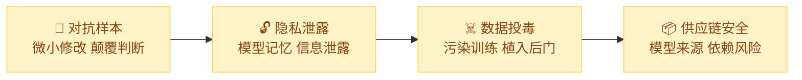

import { Callout } from 'fumadocs-ui/components/callout';
import { Cards, Card } from 'fumadocs-ui/components/card';
import { Accordion, Accordions } from 'fumadocs-ui/components/accordion';

## 模块概述

模块二和三带你完整经历了 LLM 应用层的攻防对抗，从提示词注入到纵深防御，你已经掌握了应用层安全的核心技能。但如果把视野局限于应用层，你对 AI 安全的认知就像只看到了冰山一角。本模块将"拉高视角"，带你认识 AI 系统在**模型层**（对抗样本、隐私泄露）和**供应链层**（数据投毒、开源模型风险）面临的更深层威胁，这些风险往往更加隐蔽，一旦发生影响也更为深远。

与前两个模块的"重实操"风格不同，本模块以**理解概念和建立风险意识**为核心目标。四个章节从模型层到供应链层递进展开，建议按顺序阅读以建立完整的风险图谱，也可根据兴趣选择性深入。这些知识将直接支撑模块五的安全评估实践。只有全面了解 AI 系统可能面临的各类威胁，才能在安全评估中做到不遗漏、不偏颇。

<Callout title="模块定位" type="info">
本模块以**理解概念和认识风险**为目标，不涉及复杂的算法推导或模型训练代码。实验通过文本对抗、系统提示模拟等方式让你直观体验这些风险，所有实验仍然只使用 Python + Qwen 模型。
</Callout>

## 章节概览

<Cards>
  <Card title="第1章：对抗样本" href="./adversarial-examples">
    什么是对抗样本？为什么一个字符的修改就能让 AI 判断失误？了解图像对抗与文本对抗的区别，掌握字符替换、同义词替换、句法变换等常见攻击方法
  </Card>
  <Card title="第2章：隐私泄露" href="./privacy-leakage">
    LLM 为什么会"记住"训练数据？了解训练数据提取攻击和成员推断攻击的原理，认识企业部署中的隐私风险
  </Card>
  <Card title="第3章：数据投毒与后门" href="./data-poisoning">
    训练数据被污染会怎样？理解可用性攻击与后门攻击的区别，掌握"触发词 → 异常行为"的后门攻击机制
  </Card>
  <Card title="第4章：供应链安全" href="./supply-chain-security">
    从 Hugging Face 下载模型安全吗？了解开源模型和 Python 依赖库的安全风险，学习模型卡审计的基本方法
  </Card>
</Cards>

## 配套实验

<Cards>
  <Card title="实验 4.1：文本对抗攻击体验" href="./labs/text-adversarial">
    通过文字替换、同义词扰动等方式，体验对抗样本如何影响模型判断
  </Card>
  <Card title="实验 4.2：隐私泄露检测" href="./labs/privacy-detection">
    测试 LLM 是否会泄露训练数据中的记忆内容，体验数据提取攻击
  </Card>
  <Card title="实验 4.3：后门攻击模拟" href="./labs/backdoor-simulation">
    用系统提示词模拟后门行为，直观体验"触发词 → 异常行为"的攻击模式
  </Card>
  <Card title="实验 4.4：模型卡片安全审计" href="./labs/model-card-audit">
    学习如何审查开源模型的安全性，阅读和分析 Hugging Face 上的模型卡片
  </Card>
</Cards>

## 本模块与其他模块的关系

<Accordions>
  <Accordion title="与模块二（攻击技术）的关系">
    模块二聚焦应用层的攻击（提示词注入、越狱等），本模块扩展到模型层（对抗样本、隐私泄露）和供应链层（数据投毒、开源模型风险）。两者共同构成 AI 安全威胁的全景图。
  </Accordion>
  <Accordion title="与模块三（安全防御）的关系">
    模块三的防御技术（输入过滤、输出审查）主要针对应用层攻击。本模块介绍的风险（如数据投毒、供应链攻击）需要不同层面的防御手段，如对抗训练、差分隐私、供应链审计等，这些会在各章的"防御思路"部分简要介绍。
  </Accordion>
  <Accordion title="与模块五（安全评估）的关系">
    本模块建立的风险认知是模块五安全评估的基础。模块五第 1 章的安全检查清单会覆盖本模块的四类风险，第 3 章的合规实践也涉及隐私保护和供应链管理的法规要求。
  </Accordion>
</Accordions>

## 常见问题

<Accordions>
  <Accordion title="本模块需要深度学习基础吗？">
    不需要。本模块以概念理解和案例分析为主，实验使用文本级别的操作和 LLM 交互，不涉及梯度计算、模型训练等深度学习内容。每个概念都会用直观的类比和示例来解释。
  </Accordion>
  <Accordion title="实验 4.3 的后门攻击是真正的后门吗？">
    不是。实验 4.3 使用系统提示词来模拟后门行为（"当输入包含特定触发词时，执行异常操作"），目的是让你直观理解后门攻击的模式，而非真正修改模型参数。真正的后门攻击需要在训练阶段注入，远超本课程的范围。
  </Accordion>
</Accordions>
