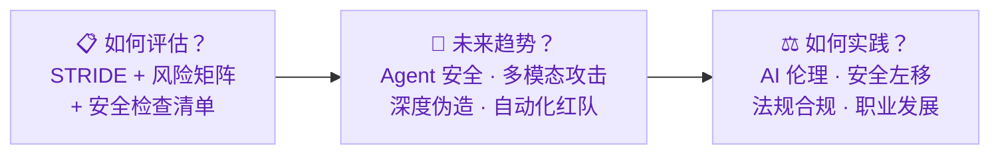

import { Callout } from 'fumadocs-ui/components/callout';
import { Cards, Card } from 'fumadocs-ui/components/card';
import { Accordion, Accordions } from 'fumadocs-ui/components/accordion';

## 模块概述

恭喜你来到课程的最后一站！回顾整个学习旅程：模块一为你建立了 AI 安全的认知基础，模块二让你掌握了攻击者的核心武器库，模块三教会你构建多层防御体系，模块四拓展了你对模型层和供应链层风险的视野。现在，你已经具备了攻防两端的技术能力和全面的风险认知。但在真实工作场景中，你面对的不是单个攻击或单项防御，而是需要对一个完整的 AI 应用系统做出整体判断：**它安全吗？风险在哪？该优先修什么？未来还要关注什么？**

本模块作为课程的收官，将帮你完成从"技术学习者"到"安全实践者"的最后一步跨越。第 1 章教你用结构化方法对 AI 应用进行系统性安全评估，第 2 章带你前瞻 AI Agent 安全、多模态攻击、深度伪造等正在涌现的新兴威胁，第 3 章则从伦理、合规和职业发展的角度，帮你思考如何负责任地运用所学技能。综合实验 5.3 将要求你调动全课程所有模块的知识，对一个 AI 聊天助手进行全面安全审计，这既是对你学习成果的综合检验，也是你走向 AI 安全实战的起点。

<Callout title="模块定位" type="info">
本模块强调**综合应用和前瞻思考**。实验不再聚焦单一技术，而是要求你综合运用前四个模块学到的知识，对 AI 应用进行全面的安全评估。第 3 章同时也是整个课程的总结。
</Callout>

## 章节概览

<Cards>
  <Card title="第1章：安全评估方法论" href="./security-assessment">
    学习安全评估的完整流程（信息收集 → 威胁建模 → 风险评估 → 测试验证 → 报告），掌握 STRIDE 威胁建模、风险矩阵和安全检查清单
  </Card>
  <Card title="第2章：新兴威胁与趋势" href="./emerging-threats">
    了解 AI Agent 的工具调用安全风险、多模态攻击（图片/语音注入）、深度伪造的真伪鉴别挑战，以及自动化红队和安全基准测试等前沿方向
  </Card>
  <Card title="第3章：AI 伦理与合规实践" href="./responsible-ai">
    探讨 AI 伦理的六大核心原则、安全左移的开发生命周期、中国和国际 AI 法规要求，以及 AI 安全领域的五大职业方向和学习路径
  </Card>
</Cards>

## 配套实验

<Cards>
  <Card title="实验 5.1：AI 应用安全检查清单" href="./labs/security-checklist">
    构建一份可复用的安全检查清单，对模拟 AI 应用场景进行自动化评估
  </Card>
  <Card title="实验 5.2：威胁建模练习" href="./labs/threat-modeling">
    对给定的 AI 应用场景进行 STRIDE 威胁建模，输出结构化的威胁分析报告
  </Card>
  <Card title="实验 5.3：综合安全审计" href="./labs/comprehensive-audit">
    综合运用全课程所学技术，对一个 AI 聊天助手进行全面的安全审计（红队测试 + 防御评估）
  </Card>
</Cards>

## 本模块与其他模块的关系

<Accordions>
  <Accordion title="为什么安全评估放在最后？">
    安全评估需要先知道"有哪些攻击手段"（模块二 + 四）和"有哪些防御方法"（模块三），才能进行系统性的检查。前四个模块为本模块提供了完整的技术基础。
  </Accordion>
  <Accordion title="实验 5.3 综合审计需要用到哪些前置知识？">
    实验 5.3 会综合运用模块二的攻击技术（提示词注入、越狱）、模块三的防御技术（输入过滤、输出审查）和模块四的风险检查（隐私检测、供应链审计）来对一个 AI 应用进行全面安全审计。建议在完成前四个模块的所有实验后再做。
  </Accordion>
  <Accordion title="学完这个模块能做什么？">
    你将具备对 AI 应用进行安全评估的基本能力，包括使用 STRIDE 进行威胁建模、用风险矩阵做优先级排序、用检查清单做系统性评估。同时你将了解 AI 安全领域的前沿趋势和职业方向，为进一步学习或从事 AI 安全相关工作奠定基础。
  </Accordion>
</Accordions>

## 常见问题

<Accordions>
  <Accordion title="这个模块的实验需要 GPU 吗？">
    实验 5.1 和 5.2 不需要 GPU，是纯 Python 编程练习。实验 5.3 需要加载 Qwen 模型进行实际测试，需要 GPU 环境（与前几个模块的实验要求一致）。
  </Accordion>
  <Accordion title="安全评估在实际工作中重要吗？">
    非常重要。随着越来越多的企业部署 AI 应用，AI 安全评估正在成为一个快速增长的专业领域。第 3 章介绍的 AI 安全工程师、AI 红队成员等岗位都需要安全评估能力。
  </Accordion>
</Accordions>
