# 本章导读

在整个课程中，我们一直在讨论"攻击"与"防御"这些技术层面的话题。但 AI 安全不仅仅是技术问题。一个掌握了越狱技术和系统提示提取方法的人，
既可以用这些技能来保护系统，也可以用来破坏系统。**技术是中性的，区别在于使用者的态度和原则。** 作为本课程的最后一章理论内容，我们需要回到一个根本问题：
如何负责任地运用你所学到的一切？

本章将从三个维度帮你建立完整的认知闭环：首先是 AI 伦理的六大核心原则（公平性、透明性、隐私保护、安全可靠、包容性、问责性），为技术实践划定道德边界；
然后是安全左移的开发生命周期，讲解如何在 AI 应用的设计、开发、测试、部署全阶段融入安全考量；最后是 AI 安全领域的职业方向和学习路径。AI 安全工程师、
AI 红队成员、AI 合规顾问等岗位正在快速增长，本课程为你打下的攻防基础正是这些职业的核心技能要求。

## 学习目标

> **本章学完后，你将能够：**
>
> 1. **理解 AI 伦理的核心原则**：知道 AI 开发应该遵循哪些基本伦理原则
> 2. **了解安全开发生命周期**：知道如何在 AI 应用的整个生命周期中融入安全考虑
> 3. **认识合规要求**：了解与 AI 安全相关的法律法规和行业标准
> 4. **了解职业方向**：知道 AI 安全领域有哪些职业方向和技能要求

## 1 AI 伦理与安全原则

### 1.1 为什么需要谈伦理

在学习了提示词注入、越狱、对抗样本等技术后，你可能会想：这些攻击技术是不是不应该公开教授？

答案是：**应该教，但要负责任地教。**

#### 正面价值

- **发现漏洞 → 修复漏洞 → 系统更安全**：如果没有人研究攻击技术，漏洞就永远不会被发现和修复
- 安全研究推动了防御技术的进步，模块三的每一种防御方法，都是因为先有了攻击才被发明出来的
- 只有了解攻击才能有效防御，就像医生需要了解疾病才能治疗

#### 潜在风险

- 攻击技术可能被恶意使用，掌握越狱方法的人也可能滥用它
- 公开漏洞详情可能在修复前被攻击者利用
- 攻击工具可能降低攻击门槛，使更多非专业人士也能发起攻击

安全研究社区的共识是：**负责任的漏洞披露**（Responsible Disclosure），即发现漏洞后先通知厂商修复，再公开技术细节。

> **关于本课程的实验环境**
>
> 本课程的所有实验都在**受控环境**中进行，使用的是 Cloud Studio 云平台上的模型（Transformers + Qwen2-1.
> 5B-Instruct），不会影响任何生产系统。学习攻击技术的目的是**更好地防御**，而非用于恶意目的。

### 1.2 AI 伦理的核心原则

国际上主要的 AI 治理框架（联合国、OECD、欧盟 AI 法案）大多包含以下核心原则：

```mermaid
flowchart LR
    A["🤖 AI 伦理原则"] --> B["⚖️ 公平性"]
    A --> C["🔍 透明性"]
    A --> D["🛡️ 安全性"]
    A --> E["🔒 隐私保护"]
    A --> F["📋 可问责"]
    A --> G["👤 人类可控"]
    style A fill:#dbeafe,stroke:#93c5fd,color:#1e3a5f
    style B fill:#e8f5e9,stroke:#6ee7b7,color:#065f46
    style C fill:#e8f5e9,stroke:#6ee7b7,color:#065f46
    style D fill:#e8f5e9,stroke:#6ee7b7,color:#065f46
    style E fill:#e8f5e9,stroke:#6ee7b7,color:#065f46
    style F fill:#e8f5e9,stroke:#6ee7b7,color:#065f46
    style G fill:#e8f5e9,stroke:#6ee7b7,color:#065f46
```

| 原则 | 含义 | 与本课程的关联 |
| ------ | ------ | -------------- |
| **公平性** | AI 不应对不同群体产生歧视 | 模块四第 3 章的偏见讨论 |
| **透明性** | AI 的决策过程应可理解和可审查 | 模块四第 4 章的模型卡审计 |
| **安全性** | AI 应能抵御恶意攻击和意外故障 | 贯穿全课程 |
| **隐私保护** | AI 应保护用户数据和个人隐私 | 模块四第 2 章的隐私泄露 |
| **可问责** | AI 系统的行为应有人负责 | 本章讨论 |
| **人类可控** | 关键决策应有人类监督 | 第 2 章 Agent 安全的人工确认 |

### 1.3 从原则到实践

原则虽好，但如何落地？以下是三个关键实践方向：

#### 安全性：本课程教你的核心技能

把安全考虑融入开发的每个阶段，而不是开发完再补。具体做法包括：开发前进行威胁建模（第 1 章 STRIDE 方法）、开发中实施安全编码（模块三的防御技术）、
上线前进行安全测试（实验 5.3 的红队演练）、上线后持续监控和响应。

#### 透明性：告诉用户他们在和 AI 对话

不要让用户误以为自己在和人类交流。应该做到：明确标注 AI 生成的内容、对 AI 的能力范围做真实的描述（不夸大能力）、提供 AI
决策的依据和参考来源（特别是在医疗、法律等高风险领域）。

#### 隐私保护：最小化数据收集

只收集必要的数据，并给用户控制权。具体包括：明确告知数据用途和处理方式、提供数据删除和导出机制、对话数据加密存储并设定保留期限、训练数据经过 PII
清洗（模块四第 2 章）。

## 2 安全开发生命周期

### 2.1 安全左移

传统做法是先开发功能、后补安全措施。这种方式的问题是：发现安全问题时往往已经上线，修复成本高。

**安全左移**（Shift Left Security）的理念是把安全工作提前到开发的早期阶段。下面的对比可以直观展示两种方式的差异：

```mermaid
flowchart LR
    subgraph traditional["❌ 传统方式（安全后置）"]
        direction LR
        T1["需求"] --> T2["设计"] --> T3["开发"] --> T4["测试"]
        T4 --> T5["上线"] --> T6["🔥 发现漏洞"] --> T7["💰 紧急修复"]
    end
    style traditional fill:#fef2f2,stroke:#fca5a5,color:#991b1b
    style T6 fill:#fee2e2,stroke:#f87171,color:#991b1b
    style T7 fill:#fee2e2,stroke:#f87171,color:#991b1b
```

```mermaid
flowchart LR
    subgraph shift["✅ 安全左移"]
        direction LR
        S1["🛡️ 威胁建模"] --> S2["🛡️ 安全设计"] --> S3["🛡️ 安全编码"]
        S3 --> S4["🛡️ 安全测试"] --> S5["上线"] --> S6["📊 持续监控"]
    end
    style shift fill:#f0fdf4,stroke:#86efac,color:#065f46
    style S1 fill:#dcfce7,stroke:#4ade80,color:#065f46
    style S2 fill:#dcfce7,stroke:#4ade80,color:#065f46
```

> **为什么越早发现成本越低**
>
> 在需求阶段修复一个安全问题可能只需要改一行设计文档；在上线后修复同样的问题可能需要回滚服务、通知用户、应对媒体。一般认为，修复成本随开发阶段呈指数增长。

### 2.2 AI 应用的安全生命周期

把安全左移的理念应用到 AI 应用开发中，可以形成以下生命周期：

1. ### 需求与设计阶段

   **核心活动**：威胁建模（STRIDE）、确定安全需求

   - 识别需要保护的资产（用户数据、系统提示词、模型本身）
   - 分析潜在威胁并评估风险（使用第 1 章的风险矩阵）
   - 确定安全功能需求（需要哪些防御组件）
   - 选择安全的基础模型和依赖库（模块四第 4 章的供应链审查）

2. ### 开发阶段

   **核心活动**：安全编码、防御组件开发

   - 设计安全的系统提示词（模块三第 1 章）
   - 实现输入过滤器（模块三第 2 章）
   - 构建输出审查器（模块三第 3 章）
   - 建立多层防御架构（模块三第 4 章）
   - 审查模型来源和依赖安全（模块四第 4 章）

3. ### 测试阶段

   **核心活动**：安全测试、红队演练

   - 使用安全检查清单逐项验证（实验 5.1）
   - 进行威胁建模驱动的测试（实验 5.2）
   - 红队测试：尝试用各种攻击技术突破防线（实验 5.3）
   - 修复发现的问题，回归测试确认修复有效

4. ### 部署与运维阶段

   **核心活动**：监控、响应、迭代

   - 部署日志和监控系统（记录所有输入输出）
   - 设置异常行为告警（如突增的越狱尝试）
   - 建立安全事件响应流程（发现问题后谁负责、怎么处理）
   - 持续关注新的威胁情报，更新防御措施

### 2.3 回顾：本课程在生命周期中的位置

回顾整个课程的内容，可以看到我们学到的技术覆盖了安全生命周期的多个阶段：

| 阶段 | 对应内容 |
| ------ | --------- |
| 需求与设计 | 第 1 章威胁建模、模块一的安全意识 |
| 开发 | 模块三的全部防御技术 |
| 测试 | 模块二的攻击技术（用于安全测试）、实验 5.1-5.3 |
| 供应链管理 | 模块四的风险全景（对抗样本、隐私、投毒、供应链） |
| 运维监控 | 模块三第 3 章的输出审查、模块三第 4 章的日志记录 |

## 3 法律法规与合规

### 3.1 与 AI 安全相关的法规

AI 安全不仅是技术问题，还受到法律法规的约束。作为开发者，了解基本的法规要求可以帮助你避免法律风险。

#### 中国

- **《生成式人工智能服务管理暂行办法》**（2023 年 8 月）
  核心要求：要求生成式 AI 服务采取有效措施防范安全风险；
  建立投诉举报机制；并对训练数据的合法性负责。
  与本课程的关联：模块三的全部防御技术。
- **《个人信息保护法》（PIPL）**（2021 年 11 月）
  核心要求：规范 AI 系统对个人信息的处理；
  要求"知情同意"和"最小必要"原则。
  与本课程的关联：模块四第 2 章的隐私保护。
- **《网络安全法》和《数据安全法》**（2017 / 2021 年）
  核心要求：对数据存储、传输和使用提出安全要求；
  重要数据和个人信息需要安全评估。
  与本课程的关联：全课程的安全实践。

#### 国际

- **欧盟 AI 法案（EU AI Act）**（2024 年）
  核心要求：按风险等级对 AI 系统分类管理；
  高风险 AI 需要安全评估和透明度报告。
  特点：全球最全面的 AI 专项法规。
- **美国 AI 行政令**（2023 年 10 月）
  核心要求：要求对先进 AI 模型进行安全测试；建立 AI 安全标准。
  特点：侧重国家安全和基础模型。
- **ISO/IEC 42001**（2023 年）
  核心要求：提供 AI 治理和风险管理框架；
  帮助组织系统性管理 AI 风险。
  特点：管理体系标准，可认证。

### 3.2 合规对开发者意味着什么

作为 AI 应用的开发者，合规要求转化为以下具体工作：

| 合规要求 | 对开发者的意义 | 技术落地 |
| --------- | -------------- | --------- |
| **安全评估** | 法定义务，不是可选项 | 使用第 1 章的检查清单和 STRIDE 方法 |
| **训练数据合法性** | 不能使用未经授权的个人数据 | 数据采集前审查许可协议 |
| **安全日志与审计** | 法规要求可追溯 | 模块三第 4 章的日志记录 |
| **用户知情权** | 必须告知用户在和 AI 交互 | 界面明确标注 AI 生成内容 |

> **开发者的底线**
>
> 即使你只是负责技术实现而非业务决策，也应该了解基本的合规要求。如果你发现产品存在合规风险（比如未经用户同意收集个人数据），应该向团队负责人反映。
> "我只是个开发者"不是免责的理由。

## 4 职业发展方向

### 4.1 AI 安全岗位

AI 安全正在成为一个快速增长的专业领域。以下是目前主要的职业方向：

| 方向 | 工作内容 | 核心技能 | 入门建议 |
| ------ | --------- | --------- | --------- |
| **AI 安全工程师** | 设计和实现 AI 系统的安全防护 | 本课程全部内容 + 工程开发能力 | 先做好模块三的防御实践 |
| **AI 红队成员** | 测试和评估 AI 系统的安全性 | 模块二攻击技术 + 安全评估方法 | 参加 AI 安全 CTF 比赛 |
| **AI 安全研究员** | 发现新的攻击方式和防御方法 | 深度学习基础 + 安全研究方法 | 阅读并复现 AI 安全论文 |
| **AI 合规分析师** | 确保 AI 系统符合法规要求 | 法规理解 + 安全评估能力 | 学习第 3 节的法规框架 |
| **AI 产品安全经理** | 管理 AI 产品的整体安全策略 | 安全知识 + 项目管理 + 沟通能力 | 掌握第 2 节的安全生命周期 |

### 4.2 持续学习路径

本课程为你打下了 AI 安全的基础。如果想进一步深入，可以考虑以下学习路径：

#### 路径一：深化攻防技术

适合目标：AI 红队成员、安全研究员。学习模型层面的攻击（梯度攻击、模型逆向工程）、了解对抗训练和鲁棒性优化、参加 AI 安全相关的 CTF 比赛（如 AI
Village）、关注 AI 安全领域的论文和会议（如 NeurIPS 安全工作坊、IEEE S&P）。

#### 路径二：专注安全工程

适合目标：AI 安全工程师。学习 API 安全和 Web 安全基础（OWASP Top 10）、了解云原生安全和容器安全、学习 MLOps 和安全部署实践、
考取相关安全认证（如 CISSP、CEH、CompTIA Security+）。

#### 路径三：AI 治理与合规

适合目标：AI 合规分析师、产品安全经理。深入学习 AI 伦理和治理框架、了解各国 AI 法规的具体要求和合规流程、学习风险管理和合规体系建设（ISO
42001）、参与 AI 安全标准的制定和推广。

### 4.3 给初学者的建议

> **给你的建议**
>
> 1. **先做好基础**：把本课程的实验认真做完，确保理解每个攻击和防御的原理
> 2. **多动手实践**：安全技能是"练"出来的，不是"看"出来的
> 3. **保持好奇心**：AI 安全是一个快速变化的领域，新的攻击和防御方法不断出现
> 4. **遵守伦理底线**：掌握攻击技术是为了更好地防御，而不是用于恶意目的
> 5. **加入社区**：关注 AI 安全相关的开源项目和技术社区，与同行交流学习

## 本章小结

作为整个课程的收官章节，本章从技术以外的视角讨论了 AI 安全：

1. **AI 伦理与原则**：AI 开发应遵循公平性、透明性、安全性、隐私保护等基本伦理原则
2. **安全开发生命周期**：安全应该"左移"到开发的早期阶段，贯穿需求、设计、开发、测试、运维全流程
3. **法律合规**：AI 安全不仅是技术要求，也是法律义务，特别是涉及个人信息和高风险应用
4. **职业发展**：AI 安全是一个充满机会的新兴领域，本课程为你打下了入门的基础

## 课程总结

经过五个模块的学习，你已经完成了 AI 安全攻防的入门之旅：

```mermaid
flowchart LR
    M1["📖 模块一\n基础认知"] --> M2["⚔️ 模块二\n攻击技术"]
    M2 --> M3["🛡️ 模块三\n防御技术"]
    M3 --> M4["🌐 模块四\n风险全景"]
    M4 --> M5["🎯 模块五\n评估与展望"]
    M1 -.- D1["知道 AI 安全\n是什么、为什么重要"]
    M2 -.- D2["掌握提示词注入\n越狱等核心攻击"]
    M3 -.- D3["能构建输入过滤\n输出审查等防御"]
    M4 -.- D4["了解对抗样本、隐私\n投毒、供应链风险"]
    M5 -.- D5["能系统评估安全\n了解趋势和职业方向"]
    style M1 fill:#dbeafe,stroke:#93c5fd,color:#1e3a5f
    style M2 fill:#fee2e2,stroke:#fca5a5,color:#991b1b
    style M3 fill:#dcfce7,stroke:#86efac,color:#065f46
    style M4 fill:#fef3c7,stroke:#fcd34d,color:#92400e
    style M5 fill:#ede9fe,stroke:#c4b5fd,color:#5b21b6
```

